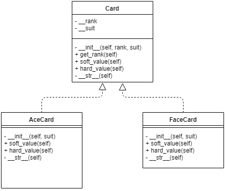

# Simple Blackjack

You will be creating a simplified version of Blackjack. 
The game rules are simple, the player with the closest score to 21, without going over, wins.

The rules are quite simple:
- If you (the Player) go over 21, you lose.
- If the other player (the Dealer) goes over 21, you win.
- If you get **exactly** 21, you win.
- If the Dealer gets **exactly** 21, you lose.
- If you both get 21, you win.

## Game Flow
1. Deal 2 Cards to each the Player and Dealer. 
The Dealer should have one card face down and the other face up. 
The Player should have both of their cards face up.
**Note:** all future played cards will be face up.

2. The Player is given two choices, either to Hit or Stay.
  * If the Player chooses to "Hit", then the dealer will add another card to the Player's hand. If the card that was drawn causes the value of the player's hand to go over 21, he Busts and loses the game.
  The player can continue to draw as long as they have not busted.
  * If the Player chooses to "Stay", then they end their turn and it becomes the dealer's turn.

3. After the player chooses to stay, it becomes the dealer's turn. The dealer will continue to draw cards until 1 of two conditions are met.
  * The dealer's hand is greater than the value of 21, in which case they lose and the player wins.
  * The dealer's hand is greater than or equal to 17, in which case the dealer will immediately stay.

4. Once the Dealer stays, assuming they haven't busted, both player's hands are compared. The player with the closest hand to 21 wins.

5. The Player will be asked to play again.

**Note:** In this game, we will be using a single deck of 52 cards.

## Card Values
Our game of Blackjack will be played with a single deck of 52 cards. 
A deck consists of 4 suits: Hearts, Clubs, Diamonds, and Spades. 
Each suit consists of 13 cards, 2-10, Jack, Queen, King, and Ace.

The *numbered* cards all hold their value, for example, a 5 of Hearts has a value of 5.

The *face* cards all have a value of 10, for example, a King of Spades has a value of 10.

The *ace* card is special. It has two values in blackjack known as hard and soft values. 
The hard value of an Ace is 1, and the soft value is an 11.
You want the value that will get you closest to 21 without going over.
So for example, an Ace of Diamonds has two values, 1 or 11.

## How do I get an A?
You will be given skeleton code that has lots of fill in the blanks. You will need to fill in the blanks (and potentially add to it).

### Building the Cards
Cards should utilize building classes and using inheritance. 
Polymorphism will be needed in order to appropriately score cards.
Your inheritance structure should follow the diagram below.

### Building the Deck
You will be filling in two methods of the deck class.
For __load_deck, you will need to create a deck of 52 cards. **Note** it may be helpful to use the constants SUITS and FACE_CARDS defined at the top of the file.
For deal_card, you will need to remove a card from the deck and return it.
If the deck is empty, you should create another deck in its place. **Hint** take a look at the \_\_init\_\_ method.

### Building a Hand
There are 4 methods to fill out in the Hand class.
For clear, you want to be able to clear out all the cards currently in the hand so that there are no cards left.
For add_card, you should add the passed in card to the self.__cards attribute.
For get_soft_score, you should loop over all the cards in the hand and get the total soft score of the hand.
For get_hard_score, you should loop over all the cards in the hand and get the total hard score of the hand.

### Gameplay
The majority of the gameplay has been written out for you. 
You are responsible for __check_if_player_busts which should return *True* if the player's hard score is greater than 21 and *False* otherwise.
Lastly, you will fill in the __check_winning_states function. To determine a winning state see the rules defined at the top.

## Notes
There is a lot going on in this project, attempt to read through and think about what to do.
Everything you need to solve this **has** been taught in class. If you need help, try looking at notes or the book.
If you ask me a question that I believe is something trivial or something you should seriously know, such as, __what is a list__, I will tell you to find it in the notes.
You're programmers now, it's time to think like one.

This shouldn't take you more than a couple of hours at most to complete.

# Good luck.

